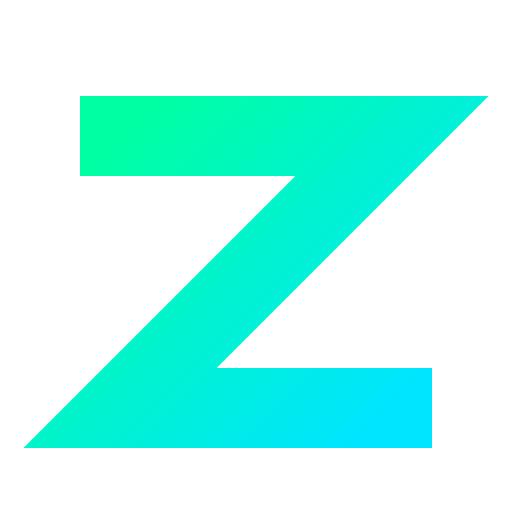

<div align="center">
  <h1> zkzzk (Chzzk Video Manager)</h1>
  <p><strong>The Ultimate Automated Recording & Management Solution for Naver Chzzk</strong></p>

  <p>
    <a href="https://github.com/k-atusa/zkzzk/releases"></a> 
    <a href="https://github.com/k-atusa/zkzzk/blob/main/LICENSE"></a> 
    <a href="https://hub.docker.com/r/d3vle0/zkzzk"></a> 
    <a href="https://github.com/k-atusa/zkzzk/stargazers"></a> 
  </p>

  <p>
    <a href="README.md">🇺🇸 English</a> | <a href="README-ko.md">🇰🇷 한국어</a>
  </p>
</div>

<hr>

## 🤔 What is zkzzk?

**zkzzk** is a powerful, open-source web application designed to automatically record broadcasts and download VODs from [Naver Chzzk](https://chzzk.naver.com). Built with a modern tech stack and a beautiful premium interface, it provides everything you need to effortlessly archive your favorite streams.

<br>

## ✨ Key Features

- **🔴 Automatic Live Recording**: Add your favorite streamers and let zkzzk automatically capture their live broadcasts in real-time.
- **📼 VOD Downloader**: Easily search and download past VODs in your preferred resolution.
- **📺 YouTube Auto Upload**: Seamlessly integrate your Google account to automatically upload recorded videos to YouTube upon completion.
- **🔔 Discord Notifications**: Receive real-time rich-card alerts in your Discord server when a stream starts, finishes, or gets uploaded.
- **🛡️ Secure Web Dashboard**: Fully-featured management dashboard with Multi-user support, Role-based Access (Admin), and 2FA (Two-Factor Authentication).
- **🌐 Fully Internationalized**: Built-in support for both English and Korean seamlessly out of the box.

<br>

## 🚀 Quick Start (Docker)

The fastest way to get zkzzk up and running is via Docker.

```bash
docker run -d \
  -p 5001:5001 \
  -e TZ=Asia/Seoul \
  -v $(pwd)/database.db:/app/backend/database.db \
  -v $(pwd)/recordings:/app/backend/recordings \
  -v $(pwd)/downloads:/app/backend/downloads \
  --name zkzzk-app \
  d3vle0/zkzzk:latest
```

Once running, simply navigate to `http://localhost:5001` to access your dashboard.

<br>

## 📚 Documentation & Installation

For comprehensive instructions on how to set up, configure, and secure your zkzzk instance, please refer to our **[GitHub Wiki](https://github.com/k-atusa/zkzzk/wiki)**.

The Wiki covers:
- 🐳 **Docker Setup** (Recommended)
- 💻 **Manual Node.js Setup** (For developers)
- 🔒 **Reverse Proxy Configuration** (Nginx / Caddy)
- 🔑 **YouTube API Integration Guide**

<br>

## 🛠️ Tech Stack

- **Frontend**: React, Vite, TailwindCSS, Shadcn UI
- **Backend**: NestJS, Prisma, SQLite
- **Core Dependencies**: FFmpeg, Streamlink, Python 3

<br>

## 🤝 Contributing

Contributions are what make the open-source community such an amazing place to learn, inspire, and create. Any contributions you make are **greatly appreciated**.

Please see the [CONTRIBUTING.md](CONTRIBUTING.md) file for detailed contribution guidelines.

## 📄 License

Distributed under the MIT License. See `LICENSE` for more information.
